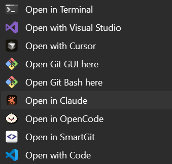

# ClaudeCodeContextMenu

Windows context menu installer for Claude Code.



## Install
```powershell
powershell -ExecutionPolicy Bypass -Command "irm https://raw.githubusercontent.com/bariskisir/ClaudeCodeContextMenu/master/install.ps1 | iex"
```

## Uninstall
```powershell
powershell -ExecutionPolicy Bypass -Command "irm https://raw.githubusercontent.com/bariskisir/ClaudeCodeContextMenu/master/uninstall.ps1 | iex"
```
